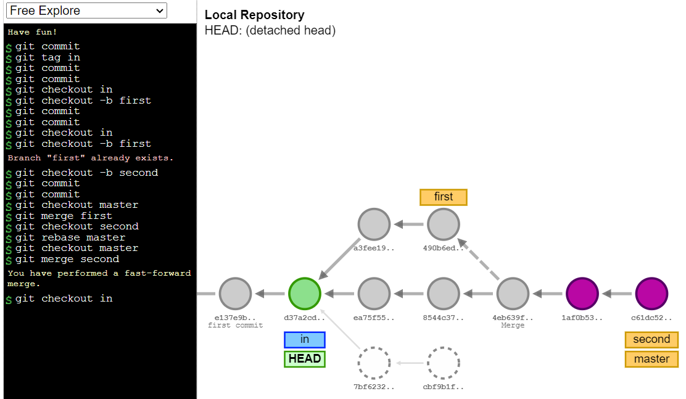
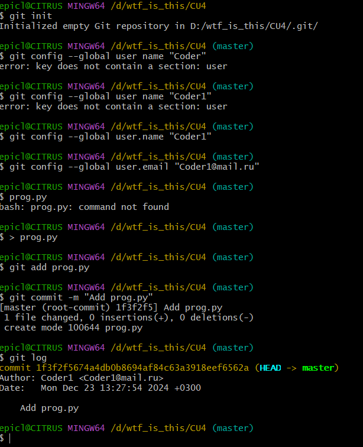
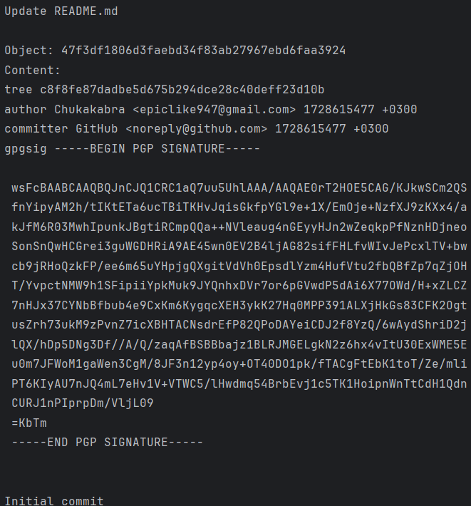

# Практическое занятие №4. Системы контроля версий

П.Н. Советов, РТУ МИРЭА

Работа с Git.

## Задача 1

<picture>
  <source media="(prefers-color-scheme: dark)" srcset="4_1.png">
  <source media="(prefers-color-scheme: light)" srcset="4_1.png">
  
</picture>

## Задача 2

<picture>
  <source media="(prefers-color-scheme: dark)" srcset="4_2.png">
  <source media="(prefers-color-scheme: light)" srcset="4_2.png">
  
</picture>

## Задача 3

```
epicl@CITRUS MINGW64 /f/Download/kf_pr4 (master)
$ cd ..

epicl@CITRUS MINGW64 /f/Download
$ mkdir server.git

epicl@CITRUS MINGW64 /f/Download
$ cd server.git

epicl@CITRUS MINGW64 /f/Download/server.git 
$ git init --bare
Initialized empty Git repository in /d/wtf_is_this/CU4server.git/
epicl@CITRUS MINGW64 /f/Download/server.git (BARE:master)
$ cd ../kf_pr4
epicl@CITRUS MINGW64 /f/Download/kf_pr4 (master) 
$ git remote add server ../server.git
epicl@CITRUS MINGW64 /f/Download/kf_pr4 (master)
 $ git push server master
Enumerating objects: 3, done.
Counting objects: 100% (3/3), done.
Writing objects: 100% (3/3), 215 bytes | 215.00 KiB/s, done.
Total 3 (delta 0), reused 0 (delta 0), pack-reused 0 (from 0) 
To ../server.git
* [new branch]	master -> master
epicl@CITRUS MINGW64 /f/Download/kf_pr4 (master)
$ git remote -v
server ../server.git (fetch)

commit a457d748f0dab75b4c642e964172887de3ef4e3e
Merge: 48ce283 d731ba8
Author: Coder 2 <coder2@corp.com>
Date: 	Sun Oct 11 11:27:09 2020 +0300

	readme fix

commit d731ba84014d603384cc3287a8ea9062dbb92303 
Author: Coder 1 <coder1@corp.com>
Date: 	Sun Oct 11 11:22:52 2020 +0300

	coder 1 info

commit 48ce28336e6b3b983cbd6323500f8ec598626f1 
Author: Coder 2 <coder2@corp.com>
Date:	 Sun Oct 11 11:24:00 2020 +0300

	coder 2 info

commit ba9dfe9cb24316694808a347e8c36f8383d81bbe
Author: Coder 2 <coder2@corp.com>
Date: 	Sun Oct 11 11:21:26 2020 +0300

	docs

commit 227d84c89e60e09eebbce6c0b94b41004a4541a4 
Author: Coder 1 <coder1@corp.com>
Date: 	Sun Oct 11 11:11:46 2020 +0300

	first commit


epicl@CITRUS MINGW64 /f/Download/kf_pr4
$ git init
Initialized empty Git repository in /d/wtf_is_this/CU4kf_pr4/.git/

epicl@CITRUS MINGW64 /f/Download/kf_pr4 (master) 
$ git config --global user.name "Coder1"

epicl@CITRUS MINGW64 /f/Download/kf_pr4 (master) 
$ git config --global user.email "Coder1@mail.ru

epicl@CITRUS MINGW64 /f/Download/kf_pr4 (master) 
$ echo "print (555)"> prog.py

epicl@CITRUS MINGW64 /f/Download/kf_pr4 (master) 
$ git add prog.py

epicl@CITRUS MINGW64 /f/Download/kf_pr4 (master) 
$ git commit -m "Add prog.py"
[master (root-commit) 27364cd] Add prog.py
1 file changed, 1 insertion(+)
create mode 100644 prog.py

epicl@CITRUS MINGW64 /f/Download/kf_pr4 (master)
$ git log
commit 27364cdd992bddc061593c77768a3ca68e74c96f (HEAD -> master)
Author: Coder1 <Coder1@mail.ru>
Date: 	Tue Nov 12 18:00:27 2024 +0300

	Add prog.py

epicl@CITRUS MINGW64 /f/Download/kf_pr4 (master)
$

server	. . /server.git (push)

epicl@CITRUS MINGW64 /f/Download/kf_pr4 (master) 
$ cd . .

epicl@CITRUS MINGW64 /f/Download
$ git clone server.git repo_clone
Cloning into 'repo_clone' . . .
done.

epicl@CITRUS MINGW64 /f/Download 
$ cd repo_clone

epicl@CITRUS MINGW64 /f/Download/repo_clone (master) 
$ git config --global user.name "Coder2"

epicl@CITRUS MINGW64 /f/Download/repo_clone (master) 
$ git config --global user.email " Coder2@mail.ru "

epicl@CITRUS MINGW64 /f/Download/repo_clone (master)
$ echo "readme" > readme.md

epicl@CITRUS MINGW64 /f/Download/repo_clone (master) 
$ git add readme.md

epicl@CITRUS MINGW64 /f/Download/repo_clone (master)
$ git commit -m "Add readme"
[master 19de552] Add readme
1 file changed, 1 insertion(+)
create mode 100644 readme.md

epicl@CITRUS MINGW64 /f/Download/repo_clone (master)
$ git push origin master
Enumerating objects: 4, done.
Counting objects: 100% (4/4), done. Delta compression using up to 12 threads Compressing objects: 100% (2/2), done.
Writing objects: 100% (3/3), 270 bytes | 270.00 KiB/s, done. Total 3 (delta 0), reused 0 (delta 0), pack-reused 0 (from 0)
To /d/wtf_is_this/CU4server.git
	27364cd…19de552 master -> master

epicl@CITRUS MINGW64 /f/Download/repo_clone (master)
$ cd …/repo 
bash: cd:	../repo: No such file or directory

epicl@CITRUS MINGW64 /f/Download/repo_clone (master) 
$ cd …/kf_pr4

epicl@CITRUS MINGW64 /f/Download/kf_pr4 (master)
$ git pull server master
remote: Enumerating objects: 4, done. 
remote: Counting objects: 100% (4/4), done. 
remote: Compressing objects: 100% (2/2), done. 
remote: Total 3 (delta 0), reused 0 (delta 0), pack-reused 0 (from 0) 
Unpacking objects: 100% (3/3), 250 bytes | 11.00 KiB/s, done. 
From …/server 
* branch 			master 			-> 	FETCH_HEAD 
   27364cd…19de552   master		        -> server/master
Updating 27364cd.19de552
Fast-forward
readme.md |  1 +
1 file changed, 1 insertion(+)
create mode 100644 readme.md

epicl@CITRUS MINGW64 /f/Download/kf_pr4 (master) 
$ echo "readme2" > readme.md

epicl@CITRUS MINGW64 /f/Download/kf_pr4 (master) 
$ git push server master Everything up-to-date

epicl@CITRUS MING#64 /f/Download/kf_pr4 (master) 
$ cd …/repo_clone

epicl@CITRUS MINGW64 /f/Download/repo_clone (master) 
$ git pull origin master
From /d/wtf_is_this/CU4server 
* branch 			master			->   FETCH_HEAD
Already up to date.

epicl@CITRUS MINGW64 /f/Download/repo_clone (master) 
$ echo "coder2" >> readme.md

epicl@CITRUS MINGW64 /f/Download/repo_clone (master) 
$ git add readme.md

epicl@CITRUS MINGW64 /f/Download/repo_clone (master) 
$ git commit -m   "Add coder2 readme" 
[master 318753b] Add coder2 readme

1 file changed, 1 insertion(+)

mishlakeMISHLAK-PC MINGW64 /f/Download/repo_clone (master) 
$ git push origin master
Enumerating objects: 5, done.
Counting objects: 100% (5/5), done.
Delta compression using up to 12 threads
Compressing objects: 100% (2/2), done. 
Writing objects: 100% (3/3), 280 bytes | 280.00 KiB/s, done.
Total 3 (delta 0), reused 0 (delta 0), pack-reused 0 (from 0)
To /d/wtf_is_this/CU4server.git 
	19de552…318753b master	->  master

epicl@CITRUS MINGW64 /f/Download/repo_clone (master) 
$ cd ./kf_pr4

epicl@CITRUS MINGW64 /f/Download/kf_pr4 (master)
$ git pull server master
remote: Enumerating objects: 5, done.
remote: Counting objects: 100% (5/5), done.
remote: Compressing objects: 100% (2/2), done. 
remote: Total 3 (delta 0), reused 0 (delta 0), pack-reused 0 (from 0) 
Unpacking objects: 100% (3/3), 260 bytes | 11.00 KiB/s, done. 
From …/server
 * branch 			master			- >   FETCH_HEAD
   19de552…318753b    master			->    server/master
Updating 19de552…318753b
error: Your local changes to the following files would be overwritten by merge:
		readme.md
Please commit your changes or stash them before you merge. 
Aborting

epicl@CITRUS MINGW64 /f/Download/kf_pr4 (master) 
$ git log
commit 19de55278ad3f757caf5dd653a40c218aef092c9  (HEAD   ->   master)
Author:   Coder2   <Coder2@mail.ru >
Date: 	Tue Nov 12 18:03:27 2024 +0300

	Add readme

commit 27364cdd992bddc061593c77760a3ca60e74c96f
Author:   Coder1 < Coder1@mail.ru > 
Date: 	Tue Nov 12 18:00:27 2024 +0300

	Add prog. py


mishlak MISHLAK-PC KINGS4 //Download/kf.pr4 (master)
$ git log
commit 19de55278ad3f757caf5dd653a40c218ef092c9 (HEAD -> master) 
Author: Coder2 <Coder2@mail.ru>
Date:	Tue Nov 12 18:03:27 2024 +0300

	Add readme

commit 27364cd6992bddc061593c7776036074c96f
Author: Coder1 <Coder1@mail.ru>
Date:	Tue Nov 12 18:00:27 2024 +0300

	Add prog-py

epicl@CITRUS KINGS4 //Download/kf.pr4 (master) 
$ git loggraph all
* commit 318753bf142683cd1fdad1b56f9fe2558664ca4 (server/master) 
Author: Coder2 «Coder2@mail.ru>
Date:	Tue Nov 12 18:05:58 2024 +0300

	Add coder2 readme

* commit 19de55278ad3f757caf5dd653a40c218ef092c9 (HEAD->master) 
Author: Coder2 <Coder2@mail.ru>
Date: 	Tue Nov 12 18:03:27 2024 +380

	Add readme

commit 2736-4cd6992bddc061593c77760a3ca60e74c96f 
Author: Coder1@mail.ru
Date: 	Tue Nov 12 18:00:27 2824 +380

	Add prog.py
```

## Задача 4

```
import subprocess
def list_git_objects(repo_path):
    subprocess.run(['git', '-C', repo_path, 'fetch'], check=True)

    try:
        objects = subprocess.check_output(['git', '-C', repo_path, 'rev-list', '--all']).decode('utf-8').strip().split(
            '\n')

        for obj in objects:
            content = subprocess.check_output(['git', '-C', repo_path, 'cat-file', '-p', obj]).decode('utf-8')
            print(f"Object: {obj}\nContent:\n{content}\n")

    except subprocess.CalledProcessError as e:
        print(f"Error: {e}")

repo_path = 'D:/wtf_is_this/GetGit/Blitznote'
list_git_objects(repo_path)
```

<picture>
  <source media="(prefers-color-scheme: dark)" srcset="4_3.png">
  <source media="(prefers-color-scheme: light)" srcset="4_3.png">
  
</picture>

## Полезные ссылки

Configuration complexity clock: https://mikehadlow.blogspot.com/2012/05/configuration-complexity-clock.html

Json: http://www.json.org/json-ru.html

Язык Jsonnet: https://jsonnet.org/learning/tutorial.html

Язык Dhall: https://dhall-lang.org/

Учебник в котором темы построения синтаксических анализаторов (БНФ, Lex/Yacc) изложены подробно: https://ita.sibsutis.ru/sites/csc.sibsutis.ru/files/courses/trans/LanguagesAndTranslationMethods.pdf

Полезные материалы для разработчика (очень рекомендую посмотреть слайды и прочие ссылки, все это актуально и для других тем нашего курса): https://habr.com/ru/company/JetBrains-education/blog/547768/
