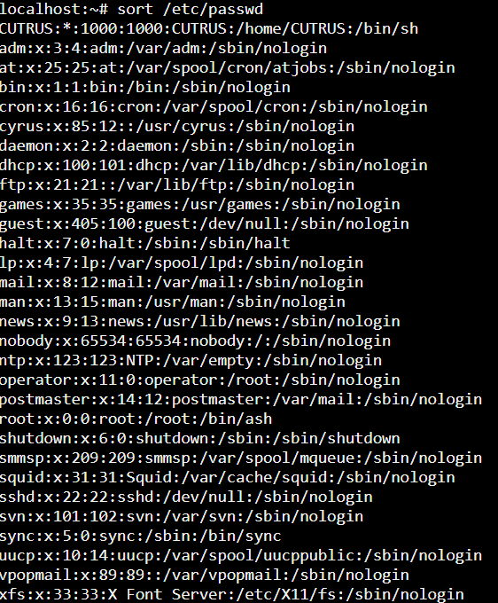
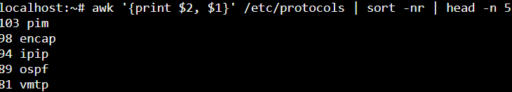
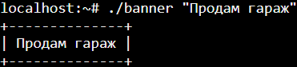

Практическое занятие №1. Введение, основы работы в командной строке

Тимофеев Никита. ИКБО-68-23.

Решение 1

<picture>
  <source media="(prefers-color-scheme: dark)" srcset="1_1.png">
  <source media="(prefers-color-scheme: light)" srcset="1_1.png">
  
</picture>

Решение 2

<picture>
  <source media="(prefers-color-scheme: dark)" srcset="1_2.png">
  <source media="(prefers-color-scheme: light)" srcset="1_2.png">
  
</picture>

Решение 3

<picture>
  <source media="(prefers-color-scheme: dark)" srcset="1_3.png">
  <source media="(prefers-color-scheme: light)" srcset="1_3.png">
  
</picture>
