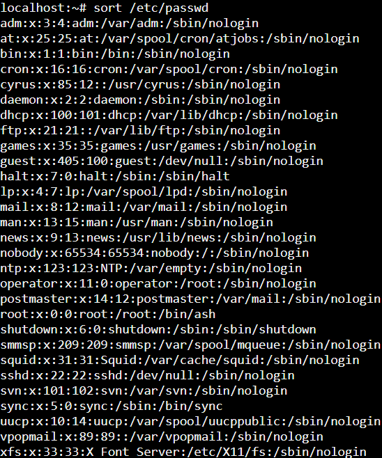

<p>Практическое занятие №1. Введение, основы работы в командной строке</p>
<p>Тимофеев Никита. ИКБО-68-23.</p>
<p></p>
<p>Решение 1</p>
<picture>
  <source media="(prefers-color-scheme: dark)" srcset="1_1.png">
  <source media="(prefers-color-scheme: light)" srcset="1_1.png">
  
</picture>
<p>Решение 2</p>
<picture>
  <source media="(prefers-color-scheme: dark)" srcset="1_2.png">
  <source media="(prefers-color-scheme: light)" srcset="1_2.png">
  
</picture>
<p>Решение 3</p>
<p>Код скрипта banner:</p>

```bash
#!/bin/bash
echo -n "+-"
for ((i=0; i<${#1}; i++))
do
        echo -n "-"
done
echo "-+"
echo "| $1 |"
echo -n "+-"
for ((i=0; i<${#1}; i++))
do
        echo -n "-"
done
echo "-+"
```

<picture>
  <source media="(prefers-color-scheme: dark)" srcset="1_3.png">
  <source media="(prefers-color-scheme: light)" srcset="1_3.png">
  
</picture>

<p>Решение 4</p>
<p>Код скрипта ident.sh:</p>

```bash
#!/bin/sh
grep -o "[a-zA-Z]*" hello.c | sort -u
```
<picture>
  <source media="(prefers-color-scheme: dark)" srcset="1_4.png">
  <source media="(prefers-color-scheme: light)" srcset="1_4.png">
  
</picture>

<p>Решение 5</p>
<p>Код скрипта reg.sh:</p>

```bash
#!/bin/sh
chmod u+rwx $1
cp $1 /usr/local/bin
```
<picture>
  <source media="(prefers-color-scheme: dark)" srcset="1_5.png">
  <source media="(prefers-color-scheme: light)" srcset="1_5.png">
  
</picture>

<p>Решение 6</p>
<p>Код скрипта comment:</p>

```bash
#!/bin/sh
line = $(head -1 $1)
if [[$line == "//"*]] || [[$line == "#"*]]; then
echo "First line have comment"
else
echo "First line doesn't have comment"
fi 
```
<picture>
  <source media="(prefers-color-scheme: dark)" srcset="1_6.png">
  <source media="(prefers-color-scheme: light)" srcset="1_6.png">
  
</picture>

<p>Решение 8</p>
<p>Код скрипта comment:</p>

```bash
#!/bin/sh
line = $(head -1 $1)
if [[$line == "//"*]] || [[$line == "#"*]]; then
echo "First line have comment"
else
echo "First line doesn't have comment"
fi 
```
<picture>
  <source media="(prefers-color-scheme: dark)" srcset="1_6.png">
  <source media="(prefers-color-scheme: light)" srcset="1_6.png">
  
</picture>
