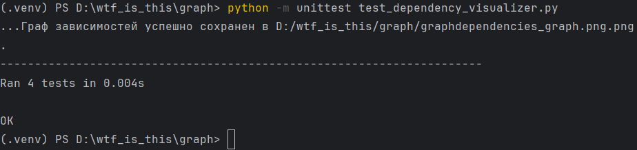
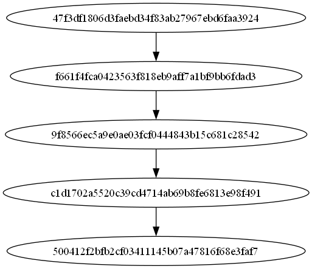

# Домашнее задание №2. Визуализация графа зависимостей

Тимофеев Никита. ИКБО-68-23. Вариант 25.

Для выполнения задания я использовал другой свой репозиторий: https://github.com/Chukakabra/Blitznote

## Код файла dependency_visualizer.py:

```Python
import json
import os
from git import Repo
import graphviz


def load_config(config_path):
    with open(config_path, 'r') as f:
        return json.load(f)


def get_commit_dependencies(repo, branch_name):
    commits = list(repo.iter_commits(branch_name))
    graph = {}

    for commit in commits:
        graph[commit.hexsha] = [parent.hexsha for parent in commit.parents]

    return graph


def create_graph(graph):
    dot = graphviz.Digraph(format='png')

    for commit, parents in graph.items():
        dot.node(commit)
        for parent in parents:
            dot.edge(parent, commit)

    return dot


def save_graph(dot, output_path):
    dot.render(output_path, cleanup=True)
    print(f"Граф зависимостей успешно сохранен в {output_path}")


def main(config_path):
    config = load_config(config_path)

    repo_path = config['repo_path']
    branch_name = config['branch_name']
    output_image_path = config['output_image_path']

    if not os.path.exists(repo_path):
        print(f"Репозиторий не найден по пути: {repo_path}")
        return

    repo = Repo(repo_path)

    graph = get_commit_dependencies(repo, branch_name)
    dot = create_graph(graph)
    save_graph(dot, output_image_path)


if __name__ == "__main__":
    main('config.json')
```

## Конфиг-файл config.json:
```JSON
{
    "graphviz_path": "D:/Programs/Graphviz-12.2.1-win64/bin/dot.exe",
    "repo_path": "D:/wtf_is_this/graph/Blitznote",
    "output_image_path": "D:/wtf_is_this/graph/graphdependencies_graph.png",
    "branch_name": "main"
}
```

## Код файла для тестов test_dependency_visualizer.py:

```Python
import unittest
from unittest.mock import MagicMock, patch
import json
import os
from dependency_visualizer import load_config, get_commit_dependencies, create_graph, save_graph  # замените 'your_module' на название вашего файла


class TestDependencyVisualizer(unittest.TestCase):

    @patch('builtins.open', new_callable=unittest.mock.mock_open, read_data='{"graphviz_path": "D:/Programs/Graphviz-12.2.1-win64/bin/dot.exe", "repo_path": "D:/wtf_is_this/graph/Blitznote", "output_image_path": "D:/wtf_is_this/graph/graphdependencies_graph.png", "branch_name": "main"}')
    def test_load_config(self, mock_open):
        config = load_config('dummy_path')
        self.assertEqual(config['graphviz_path'], 'D:/Programs/Graphviz-12.2.1-win64/bin/dot.exe')
        self.assertEqual(config['repo_path'], 'D:/wtf_is_this/graph/Blitznote')
        self.assertEqual(config['output_image_path'], 'D:/wtf_is_this/graph/graphdependencies_graph.png')
        self.assertEqual(config['branch_name'], 'main')

    @patch('git.Repo')
    def test_get_commit_dependencies(self, mock_repo_class):
        mock_repo_instance = mock_repo_class.return_value
        mock_commit_1 = MagicMock()
        mock_commit_1.hexsha = 'abc123'
        mock_commit_1.parents = []
        mock_commit_2 = MagicMock()
        mock_commit_2.hexsha = 'def456'
        mock_commit_2.parents = [mock_commit_1]
        mock_repo_instance.iter_commits.return_value = [mock_commit_1, mock_commit_2]
        dependencies = get_commit_dependencies(mock_repo_instance, 'main')
        expected_dependencies = {
            'abc123': [],
            'def456': ['abc123']
        }
        self.assertEqual(dependencies, expected_dependencies)

    def test_create_graph(self):
        graph = {
            'abc123': [],
            'def456': ['abc123']
        }
        dot = create_graph(graph)
        normalized_body = [entry.strip() for entry in dot.body]
        self.assertIn('abc123', normalized_body)
        self.assertIn('def456', normalized_body)
        self.assertIn('abc123 -> def456', normalized_body)

    @patch('graphviz.Digraph')
    def test_save_graph(self, mock_digraph):
        mock_dot = MagicMock()
        mock_digraph.return_value = mock_dot

        output_path = 'D:/wtf_is_this/graph/graphdependencies_graph.png.png'
        save_graph(mock_dot, output_path)

        mock_dot.render.assert_called_once_with(output_path, cleanup=True)


if __name__ == '__main__':
    unittest.main()
```

## Результаты тестов:
<picture>
  
</picture>

## Граф зависимостей:
<picture>
  
</picture>

## Файлы работы:
Код визуализатора: [dependency_visualizer.py](https://github.com/Chukakabra/Practice_1/blob/main/dependency_visualizer.py)

Кофиг: [config.json](https://github.com/Chukakabra/Practice_1/blob/main/config.json)

Код тестов: [test_dependency_visualizer.py](https://github.com/Chukakabra/Practice_1/blob/main/test_dependency_visualizer.py)
