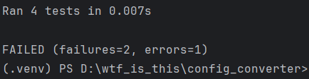

# Домашнее задание №3. Инструмент командной строки для учебного конфигурационного языка

Тимофеев Никита. ИКБО-68-23. Вариант 25.

## Код файла config_converter.py:

```Python
import argparse
import re
import sys
import yaml

def parse_input(file_path):
    with open(file_path, 'r') as file:
        content = file.read()
    return content

def remove_comments(content):
    content = re.sub(r'\|\|.*', '', content)
    content = re.sub(r'\{\{!.*?\}\}', '', content, flags=re.DOTALL)
    return content

def parse_array(array_str):
    array_str = array_str.strip('[]')
    items = array_str.split(',')
    return [parse_value(item.strip()) for item in items]

def parse_dict(dict_str):
    dict_str = dict_str.strip('table(')
    items = dict_str.split(',')
    result = {}
    for item in items:
        if '=>' in item:
            key, value = item.split('=>', 1)  # Используем 1, чтобы разделить только на 2 части
            result[key.strip()] = parse_value(value.strip())
        else:
            raise ValueError(f"Invalid dictionary item: {item}")
    return result

def parse_value(value):
    print(f"Parsing value: {value}")
    value = value.strip()
    if value.startswith('[') and value.endswith(']'):
        return parse_array(value)
    elif value.startswith('table(') and value.endswith(')'):
        return parse_dict(value)
    elif value.isdigit():
        return int(value)
    elif re.match(r'^\$[_a-z]+', value):
        return value[1:]
    elif value.startswith('"') and value.endswith('"'):
        return value[1:-1]
    else:
        return value


def convert_to_yaml(content):
    lines = content.splitlines()
    result = {}
    for line in lines:
        line = line.strip()
        if line.startswith('var'):
            _, name, value = line.split(maxsplit=2)
            result[name] = parse_value(value)
    return yaml.dump(result)

def main():
    parser = argparse.ArgumentParser(description='Convert custom config language to YAML.')
    parser.add_argument('file', type=str, help='Path to the input configuration file')
    args = parser.parse_args()

    try:
        content = parse_input(args.file)
        content = remove_comments(content)
        yaml_output = convert_to_yaml(content)
        print(yaml_output)
    except Exception as e:
        print(f"Error: {e}", file=sys.stderr)

if __name__ == '__main__':
    main()
```

## Код файла для тестов test_config_converter.py:

```Python
import unittest
import yaml
from config_converter import parse_input, remove_comments, convert_to_yaml

class TestConfigParser(unittest.TestCase):

    def test_simple_config(self):
        with open('tests/sample_configs/config1.txt', 'r') as file:
            expected_output = '''
age: 30
hobbies:
- reading
- coding
- hiking
name: John Doe
'''
        content = parse_input('tests/sample_configs/config1.txt')
        content = remove_comments(content)
        yaml_output = convert_to_yaml(content)
        self.assertEqual(yaml.safe_load(yaml_output), yaml.safe_load(expected_output))

    def test_config_with_table(self):
        with open('tests/sample_configs/config2.txt', 'r') as file:
            expected_output = '''
server:
  host: localhost
  port: 8080
'''
        content = parse_input('tests/sample_configs/config2.txt')
        content = remove_comments(content)
        yaml_output = convert_to_yaml(content)
        self.assertEqual(yaml.safe_load(yaml_output), yaml.safe_load(expected_output))

    def test_config_with_nested_table(self):
        with open('tests/sample_configs/config3.txt', 'r') as file:
            expected_output = '''
settings:
  debug: true
  languages:
  - python
  - javascript
  version: 1.0
'''
        content = parse_input('tests/sample_configs/config3.txt')
        content = remove_comments(content)
        yaml_output = convert_to_yaml(content)
        self.assertEqual(yaml.safe_load(yaml_output), yaml.safe_load(expected_output))

    def test_config_with_invalid_syntax(self):
        with self.assertRaises(ValueError):
            content = parse_input('invalid_config.txt')
            content = remove_comments(content)
            convert_to_yaml(content)

if __name__ == '__main__':
    unittest.main()
```

## Кофиг-файл config1.txt:
```txt
|| Пример конфигурации 1
var name "John Doe"
var age 30
var hobbies [reading, coding, hiking]
```

## Кофиг-файл config2.txt:
```txt
|| Пример конфигурации 2
var server table(
    host => "localhost",
    port => 8080
)
```

## Кофиг-файл config3.txt:
```txt
|| Пример конфигурации 3
var settings table(
    debug => true,
    version => 1.0,
    languages => [python, javascript]
)
```

## Результаты тестов:
<picture>
  
</picture>

Исправить код, к сожалению, не получилось.

## Файлы работы:
Код конвертера: [config_converter.py](https://github.com/Chukakabra/Practice_1/blob/main/config_converter.py)

Код тестов: [test_config_converter.py](https://github.com/Chukakabra/Practice_1/blob/main/test_config_converter.py)

config1.txt: [config1.txt](https://github.com/Chukakabra/Practice_1/blob/main/config1.txt)

config2.txt: [config2.txt](https://github.com/Chukakabra/Practice_1/blob/main/config2.txt)

config3.txt: [config3.txt](https://github.com/Chukakabra/Practice_1/blob/main/config3.txt)
